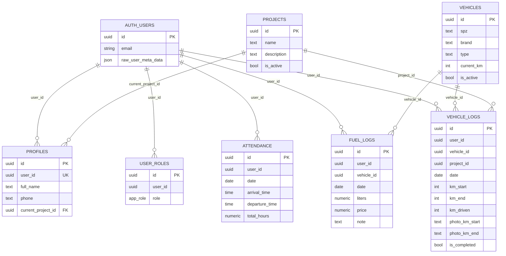

# DATABASE SCHEMA - Kompletná Databáza

*Single Source of Truth pre databázovú štruktúru*

---

## 📊 PREHĽAD TABULIEK

| Tabuľka | Účel | RLS | Riadkov (cca) |
|---------|------|-----|---------------|
| `attendance` | Evidencia dochádzky | ✅ | Rastie denne |
| `fuel_logs` | Evidencia tankovaní | ✅ | Rastie podľa použitia |
| `profiles` | Profily používateľov | ✅ | = počet userov |
| `projects` | Zoznam projektov | ✅ | Statický |
| `user_roles` | Role používateľov | ✅ | = počet userov |
| `vehicle_logs` | Evidencia jázd | ✅ | Rastie denne |
| `vehicles` | Zoznam vozidiel | ✅ | Statický |

---

## 1️⃣ ATTENDANCE (Dochádzka)

### Stĺpce

| Stĺpec | Typ | Nullable | Default | Popis |
|--------|-----|----------|---------|-------|
| `id` | uuid | No | `gen_random_uuid()` | Primary key |
| `user_id` | uuid | No | - | Foreign key na auth.users |
| `date` | date | No | - | Dátum dochádzky |
| `arrival_time` | time | Yes | - | Čas príchodu (HH:MM:SS) |
| `departure_time` | time | Yes | - | Čas odchodu (HH:MM:SS) |
| `total_hours` | numeric | Yes | - | Odpracované hodiny (decimal) |
| `created_at` | timestamptz | No | `now()` | Timestamp vytvorenia |

### Indexes
```sql
-- PRIMARY KEY index (automatický)
✅ CREATE INDEX idx_attendance_user_id ON attendance(user_id);
✅ CREATE INDEX idx_attendance_date ON attendance(date);
```

### RLS Policies

| Policy Name | Command | Using | With Check |
|-------------|---------|-------|------------|
| Users can view their own attendance | SELECT | `auth.uid() = user_id` | - |
| Users can insert their own attendance | INSERT | - | `auth.uid() = user_id` |
| Users can update their own attendance | UPDATE | `auth.uid() = user_id` | - |
| Admins can view all attendance | SELECT | `has_role(auth.uid(), 'admin')` | - |
| Admins can manage all attendance | ALL | `has_role(auth.uid(), 'admin')` | - |

### Business Pravidlá
- ✅ **CONSTRAINT:** `attendance_user_date_unique` - user môže mať len 1 záznam za deň
- ⚠️ **CHÝBA:** Check constraint `departure_time > arrival_time` (ak oba vyplnené)
- ✅ `total_hours` sa počíta v aplikačnom kóde (nie DB trigger)

### Vzťahy
- `user_id` → (implicitne) `auth.users.id` (nie je foreign key kvôli Supabase odporúčaniu)

---

## 2️⃣ FUEL_LOGS (Tankovania)

### Stĺpce

| Stĺpec | Typ | Nullable | Default | Popis |
|--------|-----|----------|---------|-------|
| `id` | uuid | No | `gen_random_uuid()` | Primary key |
| `user_id` | uuid | No | - | Kto tankoval |
| `vehicle_id` | uuid | No | - | Ktoré vozidlo |
| `date` | date | No | - | Dátum tankovania |
| `liters` | numeric | No | - | Počet litrov |
| `price` | numeric | Yes | - | Celková cena |
| `note` | text | Yes | - | Poznámka |
| `created_at` | timestamptz | No | `now()` | Timestamp vytvorenia |

### Indexes
```sql
✅ CREATE INDEX idx_fuel_logs_user_id ON fuel_logs(user_id);
✅ CREATE INDEX idx_fuel_logs_vehicle_id ON fuel_logs(vehicle_id);
✅ CREATE INDEX idx_fuel_logs_date ON fuel_logs(date);
```

### RLS Policies

| Policy Name | Command | Using | With Check |
|-------------|---------|-------|------------|
| Users can view their own fuel logs | SELECT | `auth.uid() = user_id` | - |
| Users can insert their own fuel logs | INSERT | - | `auth.uid() = user_id` |
| Users can update their own fuel logs | UPDATE | `auth.uid() = user_id` | - |
| Admins can view all fuel logs | SELECT | `has_role(auth.uid(), 'admin')` | - |
| Admins can manage all fuel logs | ALL | `has_role(auth.uid(), 'admin')` | - |

### Business Pravidlá
- ✅ **CLIENT-SIDE:** Zod validácia `liters > 0` (max 500L)
- ✅ **CLIENT-SIDE:** Zod validácia `price >= 0` (max 10000€)
- ⚠️ **POZNÁMKA:** DB constraints neboli pridané (validácia len na frontend)

### Vzťahy
- `user_id` → (implicitne) `auth.users.id`
- `vehicle_id` → (nie je definovaný foreign key v schéme, ale je používaný v kóde)

---

## 3️⃣ PROFILES (Používateľské profily)

### Stĺpce

| Stĺpec | Typ | Nullable | Default | Popis |
|--------|-----|----------|---------|-------|
| `id` | uuid | No | `gen_random_uuid()` | Primary key |
| `user_id` | uuid | No | - | Foreign key na auth.users (UNIQUE) |
| `full_name` | text | No | - | Celé meno používateľa |
| `phone` | text | Yes | - | Telefónne číslo |
| `current_project_id` | uuid | Yes | - | Aktuálny projekt zamestnanca |
| `created_at` | timestamptz | No | `now()` | Timestamp vytvorenia |

### Indexes
```sql
-- UNIQUE constraint na user_id (automatický index)
```

### RLS Policies

| Policy Name | Command | Using | With Check |
|-------------|---------|-------|------------|
| Users can view their own profile | SELECT | `auth.uid() = user_id` | - |
| Users can update their own profile | UPDATE | `auth.uid() = user_id` | - |
| Admins can view all profiles | SELECT | `has_role(auth.uid(), 'admin')` | - |
| Admins can insert profiles | INSERT | - | `has_role(auth.uid(), 'admin')` |
| Admins can update all profiles | UPDATE | `has_role(auth.uid(), 'admin')` | - |
| Admins can delete profiles | DELETE | `has_role(auth.uid(), 'admin')` | - |

### Business Pravidlá
- ✅ Auto-vytvorenie cez trigger `handle_new_user()` po signup
- ✅ **Admin môže DELETE** profily (policy pridaná)
- ❌ **Users nemôžu DELETE** svoj vlastný profil (správne!)
- ⚠️ Employee nemôže INSERT svoj profil (správne, admin/trigger musí)
- ✅ **IMPLEMENTOVANÉ (2025-01-20):** `current_project_id` - aktuálny projekt zamestnanca (nullable)
- ✅ **IMPLEMENTOVANÉ (2025-01-20):** Employee môže UPDATE svoj profil (full_name, phone) cez stránku /profile

### Vzťahy
- `user_id` → (implicitne) `auth.users.id` (nie je foreign key v schéme)
- `current_project_id` → `projects.id` (foreign key)

---

## 4️⃣ PROJECTS (Projekty)

### Stĺpce

| Stĺpec | Typ | Nullable | Default | Popis |
|--------|-----|----------|---------|-------|
| `id` | uuid | No | `gen_random_uuid()` | Primary key |
| `name` | text | No | - | Názov projektu |
| `description` | text | Yes | - | Popis projektu |
| `status` | project_status | No | `'planned'` | Stav projektu (enum) |
| `is_active` | boolean | No | `true` | Aktívny/neaktívny (DEPRECATED, používa sa status) |
| `created_at` | timestamptz | No | `now()` | Timestamp vytvorenia |

### ENUM: project_status
```sql
CREATE TYPE project_status AS ENUM ('planned', 'active', 'completed');
```

### Indexes
```sql
-- ⚠️ ODPORÚČANÉ: CREATE INDEX idx_projects_status ON projects(status);
```

### RLS Policies

| Policy Name | Command | Using | With Check |
|-------------|---------|-------|------------|
| Employees can view active projects | SELECT | `status = 'active'` | - |
| Admins can manage all projects | ALL | `has_role(auth.uid(), 'admin')` | - |

### Business Pravidlá
- ✅ Employee vidí len `status = 'active'` projekty
- ✅ Admin môže meniť status projektu (planned/active/completed)
- ✅ **IMPLEMENTOVANÉ (2025-01-20):** Tri stavy namiesto boolean
- ⚠️ `is_active` stĺpec je ponechaný pre backward compatibility, ale NEPOUŽÍVA SA

### Vzťahy
- Žiadne foreign keys

---

## 5️⃣ USER_ROLES (Role používateľov)

### Stĺpce

| Stĺpec | Typ | Nullable | Default | Popis |
|--------|-----|----------|---------|-------|
| `id` | uuid | No | `gen_random_uuid()` | Primary key |
| `user_id` | uuid | No | - | Foreign key na auth.users |
| `role` | app_role | No | `'employee'` | Rola (enum) |
| `created_at` | timestamptz | No | `now()` | Timestamp vytvorenia |

### ENUM: app_role
```sql
CREATE TYPE app_role AS ENUM ('admin', 'employee');
```

### Indexes
```sql
-- UNIQUE constraint na (user_id, role) - user nemôže mať duplicitnú rolu
```

### RLS Policies

| Policy Name | Command | Using | With Check |
|-------------|---------|-------|------------|
| Users can view their own role | SELECT | `auth.uid() = user_id` | - |
| Admins can view all roles | SELECT | `has_role(auth.uid(), 'admin')` | - |
| Admins can manage roles | ALL | `has_role(auth.uid(), 'admin')` | - |

### Business Pravidlá
- ✅ **KRITICKÉ:** Role sú v separátnej tabuľke (nie na profile!)
- ✅ Unique constraint `(user_id, role)` - user môže mať každú rolu max 1x
- ✅ Default rola je `'employee'`
- ✅ **IMPLEMENTOVANÉ (2025-01-20):** Admin môže zmeniť rolu cez UI (Employee/Admin dropdown)

### Vzťahy
- `user_id` → (implicitne) `auth.users.id`

---

## 6️⃣ VEHICLE_LOGS (Evidencia jázd)

### Stĺpce

| Stĺpec | Typ | Nullable | Default | Popis |
|--------|-----|----------|---------|-------|
| `id` | uuid | No | `gen_random_uuid()` | Primary key |
| `user_id` | uuid | No | - | Kto jazdil |
| `vehicle_id` | uuid | No | - | Ktoré vozidlo |
| `project_id` | uuid | No | - | Pre ktorý projekt |
| `date` | date | No | - | Dátum jazdy |
| `km_start` | integer | No | - | Začiatočný stav km |
| `km_end` | integer | Yes | - | Konečný stav km (nullable pre rozpracované jazdy) |
| `km_driven` | integer | Yes | - | Ujazdené km (vypočítané) |
| `photo_km_start` | text | Yes | - | Cesta k fotke začiatočného stavu km |
| `photo_km_end` | text | Yes | - | Cesta k fotke konečného stavu km |
| `is_completed` | boolean | No | `false` | Či je jazda ukončená |
| `created_at` | timestamptz | No | `now()` | Timestamp vytvorenia |

### Indexes
```sql
✅ CREATE INDEX idx_vehicle_logs_user_id ON vehicle_logs(user_id);
✅ CREATE INDEX idx_vehicle_logs_vehicle_id ON vehicle_logs(vehicle_id);
-- ⚠️ CHÝBA: CREATE INDEX idx_vehicle_logs_project_id ON vehicle_logs(project_id); (nebol pridaný)
✅ CREATE INDEX idx_vehicle_logs_date ON vehicle_logs(date);
```

### RLS Policies

| Policy Name | Command | Using | With Check |
|-------------|---------|-------|------------|
| Users can view their own vehicle logs | SELECT | `auth.uid() = user_id` | - |
| Users can insert their own vehicle logs | INSERT | - | `auth.uid() = user_id` |
| Users can update their own vehicle logs | UPDATE | `auth.uid() = user_id` | - |
| Admins can view all vehicle logs | SELECT | `has_role(auth.uid(), 'admin')` | - |
| Admins can manage all vehicle logs | ALL | `has_role(auth.uid(), 'admin')` | - |

### Business Pravidlá
- ✅ **CLIENT-SIDE:** Zod validácia `km_end > km_start` + pozitívne celé čísla
- ✅ **TRIGGER:** `trigger_update_vehicle_km` automaticky aktualizuje `vehicles.current_km`
- ✅ **IMPLEMENTOVANÉ (2025-01-20):** Workflow s fotkami - užívateľ začne jazdu s km_start a foto, neskôr ukončí s km_end a foto
- ✅ **STORAGE:** `vehicle-photos` bucket pre fotky km stavov (RLS: vlastník môže upload/view, admin view all)
- `km_driven` je nullable (počíta sa až po ukončení jazdy)
- `km_end` je nullable (vyplní sa až pri ukončení jazdy)

### Vzťahy
- `user_id` → (implicitne) `auth.users.id`
- `vehicle_id` → (nie je foreign key)
- `project_id` → (nie je foreign key)

---

## 7️⃣ VEHICLES (Vozidlá)

### Stĺpce

| Stĺpec | Typ | Nullable | Default | Popis |
|--------|-----|----------|---------|-------|
| `id` | uuid | No | `gen_random_uuid()` | Primary key |
| `spz` | text | No | - | Štátna poznávacia značka |
| `brand` | text | No | - | Značka vozidla |
| `type` | text | No | - | Typ/model |
| `current_km` | integer | No | `0` | Aktuálny stav kilometrov |
| `is_active` | boolean | No | `true` | Aktívne/neaktívne |
| `created_at` | timestamptz | No | `now()` | Timestamp vytvorenia |

### Indexes
```sql
-- ⚠️ CHÝBA: CREATE INDEX idx_vehicles_is_active ON vehicles(is_active);
-- ⚠️ MOŽNOSŤ: CREATE UNIQUE INDEX idx_vehicles_spz ON vehicles(spz); (ak SPZ sú unikátne)
```

### RLS Policies

| Policy Name | Command | Using | With Check |
|-------------|---------|-------|------------|
| Employees can view active vehicles | SELECT | `is_active = true` | - |
| Admins can manage all vehicles | ALL | `has_role(auth.uid(), 'admin')` | - |

### Business Pravidlá
- ✅ Employee vidí len `is_active = true` vozidlá
- ✅ Admin môže deaktivovať vozidlo (toggle `is_active`)
- ✅ **TRIGGER:** Auto-update `current_km` po každej jazde implementovaný (funkcia `update_vehicle_current_km`)
- ⚠️ **CHÝBA:** Unique constraint na `spz` (ak to je požiadavka)

### Vzťahy
- Žiadne foreign keys

---

## 🔧 FUNKCIE (Functions)

### 1. `has_role(_user_id uuid, _role app_role) RETURNS boolean`

**Účel:** Bezpečná kontrola role pre RLS policies

**Kód:**
```sql
CREATE OR REPLACE FUNCTION public.has_role(_user_id uuid, _role app_role)
RETURNS boolean
LANGUAGE sql
STABLE
SECURITY DEFINER
SET search_path = 'public'
AS $$
  SELECT EXISTS (
    SELECT 1
    FROM public.user_roles
    WHERE user_id = _user_id
      AND role = _role
  )
$$;
```

**Prečo SECURITY DEFINER:**
- RLS policies by inak spôsobili rekurziu (policy → funkcia → policy → ...)
- SECURITY DEFINER beží s elevated privileges (obchádza RLS)

**Použitie:**
```sql
-- V RLS policy
CREATE POLICY "Admins can view all"
ON some_table
FOR SELECT
USING (public.has_role(auth.uid(), 'admin'));
```

---

### 2. `handle_new_user() RETURNS trigger`

**Účel:** Automaticky vytvoriť profile + rolu pri signup

**Kód:**
```sql
CREATE OR REPLACE FUNCTION public.handle_new_user()
RETURNS trigger
LANGUAGE plpgsql
SECURITY DEFINER
SET search_path = 'public'
AS $$
BEGIN
  -- Insert profile
  INSERT INTO public.profiles (user_id, full_name)
  VALUES (
    NEW.id,
    COALESCE(NEW.raw_user_meta_data->>'full_name', NEW.email)
  );
  
  -- Assign default employee role
  INSERT INTO public.user_roles (user_id, role)
  VALUES (NEW.id, 'employee');
  
  RETURN NEW;
END;
$$;
```

**Trigger:**
```sql
-- ⚠️ CHÝBA V SCHÉME (ale existuje v DB lebo funguje!)
CREATE TRIGGER on_auth_user_created
  AFTER INSERT ON auth.users
  FOR EACH ROW
  EXECUTE FUNCTION public.handle_new_user();
```

**Flow:**
1. User sa zaregistruje cez `supabase.auth.signUp()`
2. Supabase vytvorí záznam v `auth.users`
3. Trigger sa spustí
4. Funkcia vytvorí záznam v `profiles` a `user_roles`

---

### 3. `update_vehicle_current_km() RETURNS trigger`

**Účel:** Automaticky aktualizovať `vehicles.current_km` po ukončení jazdy

**Kód:**
```sql
CREATE OR REPLACE FUNCTION public.update_vehicle_current_km()
RETURNS TRIGGER
LANGUAGE plpgsql
SECURITY DEFINER
SET search_path = public
AS $$
BEGIN
  -- Only update if km_end is not NULL
  IF NEW.km_end IS NOT NULL THEN
    UPDATE public.vehicles
    SET current_km = NEW.km_end
    WHERE id = NEW.vehicle_id;
  END IF;
  
  RETURN NEW;
END;
$$;
```

**Trigger:**
```sql
CREATE TRIGGER trigger_update_vehicle_km
  AFTER INSERT OR UPDATE OF km_end ON vehicle_logs
  FOR EACH ROW
  EXECUTE FUNCTION public.update_vehicle_current_km();
```

**Flow:**
1. User ukončí jazdu (UPDATE `vehicle_logs` SET `km_end = X`)
2. Trigger sa spustí po INSERT alebo UPDATE na `km_end`
3. Funkcia skontroluje či `km_end IS NOT NULL` a aktualizuje `vehicles.current_km`

---

---

## 📦 STORAGE BUCKETS

### `vehicle-photos` (Private)

**Účel:** Úložisko pre fotky odometrov pri začatí/ukončení jazdy

**Konfigurácia:**
```sql
-- Bucket je PRIVATE (public = false)
INSERT INTO storage.buckets (id, name, public) 
VALUES ('vehicle-photos', 'vehicle-photos', false);
```

**RLS Policies:**

| Policy Name | Command | Using | With Check |
|-------------|---------|-------|------------|
| Users can upload own vehicle photos | INSERT | - | `auth.uid()::text = (storage.foldername(name))[1]` |
| Users can view own vehicle photos | SELECT | `auth.uid()::text = (storage.foldername(name))[1]` | - |
| Admins can view all vehicle photos | SELECT | `has_role(auth.uid(), 'admin')` | - |

**File Path Pattern:**
```
vehicle-photos/
  └── {user_id}/
      └── {timestamp}_{type}.jpg
```

**Príklad:**
```
vehicle-photos/550e8400-e29b-41d4-a716-446655440000/1737377940123_start.jpg
```

**Business Pravidlá:**
- ✅ Employee môže nahrať fotku len do svojho folderu (`user_id`)
- ✅ Employee môže vidieť len svoje fotky
- ✅ Admin môže vidieť všetky fotky
- ✅ Fotky sú súčasťou workflow začatia/ukončenia jazdy
- ⚠️ **CHÝBA:** Validácia file size (max 5MB odporúčané)
- ⚠️ **CHÝBA:** Validácia file type (len JPG/PNG/WEBP)

---

## 🚨 CHÝBAJÚCE CONSTRAINTS & INDEXES

### ✅ Implementované (2025-01-20)
```sql
-- ✅ Dochádzka: Ochrana proti viacnásobným check-inom
ALTER TABLE attendance 
ADD CONSTRAINT attendance_user_date_unique UNIQUE (user_id, date);

-- ✅ Indexes pre performance (všetky vytvorené)
CREATE INDEX idx_attendance_user_id ON attendance(user_id);
CREATE INDEX idx_attendance_date ON attendance(date);
CREATE INDEX idx_fuel_logs_user_id ON fuel_logs(user_id);
CREATE INDEX idx_fuel_logs_vehicle_id ON fuel_logs(vehicle_id);
CREATE INDEX idx_fuel_logs_date ON fuel_logs(date);
CREATE INDEX idx_vehicle_logs_user_id ON vehicle_logs(user_id);
CREATE INDEX idx_vehicle_logs_vehicle_id ON vehicle_logs(vehicle_id);
CREATE INDEX idx_vehicle_logs_date ON vehicle_logs(date);

-- ✅ Trigger pre automatic current_km update
CREATE FUNCTION update_vehicle_current_km() ...
CREATE TRIGGER trigger_update_vehicle_km ...

-- ✅ DELETE policy pre profiles (admins)
CREATE POLICY "Admins can delete profiles" ...
```

### Nie je implementované (len client-side validácia)
```sql
-- ⚠️ Tankovania: Validácia litrov (len Zod)
-- ALTER TABLE fuel_logs 
-- ADD CONSTRAINT check_liters_positive CHECK (liters > 0);

-- ⚠️ Jazdy: Validácia km (len Zod)
-- ALTER TABLE vehicle_logs 
-- ADD CONSTRAINT check_km_end_greater CHECK (km_end > km_start);
```

### Optional (nice to have)
```sql
-- Unique SPZ
ALTER TABLE vehicles 
ADD CONSTRAINT unique_spz UNIQUE (spz);

-- Validácia ceny tankovania
ALTER TABLE fuel_logs 
ADD CONSTRAINT check_price_non_negative CHECK (price IS NULL OR price >= 0);

-- Validácia arrival < departure
ALTER TABLE attendance 
ADD CONSTRAINT check_departure_after_arrival 
CHECK (departure_time IS NULL OR arrival_time IS NULL OR departure_time > arrival_time);
```

---

## 🔗 FOREIGN KEYS (nie sú definované, ale používané)

### Prečo nie sú foreign keys?
- Supabase odporúča **nevytvárať foreign keys na `auth.users`** tabuľku
- Dôvod: `auth.users` je managed by Supabase, môže sa zmeniť
- Riešenie: Používame `user_id` ako UUID bez foreign key

### Implicitné vzťahy (používané v kóde)
```
attendance.user_id              → auth.users.id
fuel_logs.user_id               → auth.users.id
fuel_logs.vehicle_id            → vehicles.id
profiles.user_id                → auth.users.id (UNIQUE)
profiles.current_project_id     → projects.id (FK)
user_roles.user_id              → auth.users.id
vehicle_logs.user_id            → auth.users.id
vehicle_logs.vehicle_id         → vehicles.id
vehicle_logs.project_id         → projects.id
```

### Možné foreign keys (ak chceme)
```sql
-- Len pre non-auth tabuľky
ALTER TABLE fuel_logs 
ADD FOREIGN KEY (vehicle_id) REFERENCES vehicles(id) ON DELETE CASCADE;

ALTER TABLE vehicle_logs 
ADD FOREIGN KEY (vehicle_id) REFERENCES vehicles(id) ON DELETE CASCADE,
ADD FOREIGN KEY (project_id) REFERENCES projects(id) ON DELETE CASCADE;
```

---

## 📊 DIAGRAM VZŤAHOV



---

## 🔐 RLS SUMMARY

### Pattern pre všetky tabuľky
```sql
-- Employee: Môže vidieť/upraviť len svoje
SELECT/INSERT/UPDATE: auth.uid() = user_id

-- Admin: Môže všetko
ALL: has_role(auth.uid(), 'admin')
```

### Výnimky
- **projects:** Employee môže vidieť len `status = 'active'`
- **vehicles:** Employee môže vidieť len `is_active = true`
- **profiles:** Employee nemôže INSERT (admin/trigger musí)
- **profiles:** Admin môže DELETE (employee nemôže)
- **storage.objects (vehicle-photos):** Employee môže upload/view len svoje, Admin view all

---

## 📝 POZNÁMKY

1. **Žiadne foreign keys na auth.users** - Supabase best practice
2. **SECURITY DEFINER funkcie** - Kritické pre RLS (obchádza rekurziu)
3. **Auto-increment nie je UUID** - Všetky ID sú UUID (gen_random_uuid())
4. **Soft delete pattern** - `is_active` flag namiesto DELETE
5. **Timestamps** - Všetky tabuľky majú `created_at`
6. **Chýbajú updated_at** - Žiadna tabuľka nemá `updated_at` stĺpec + trigger
7. **Storage bucket** - `vehicle-photos` pre fotky odometrov (private)
8. **Photo workflow** - Employee začne jazdu s km_start + foto, ukončí s km_end + foto
9. **Trigger auto-update** - `vehicles.current_km` sa automaticky aktualizuje po ukončení jazdy
